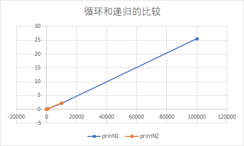
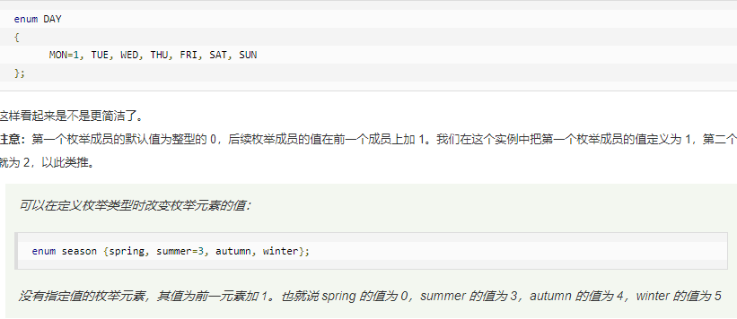
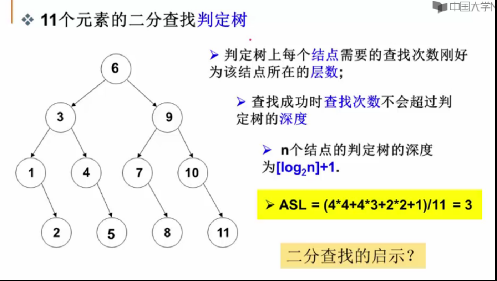
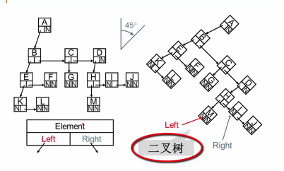
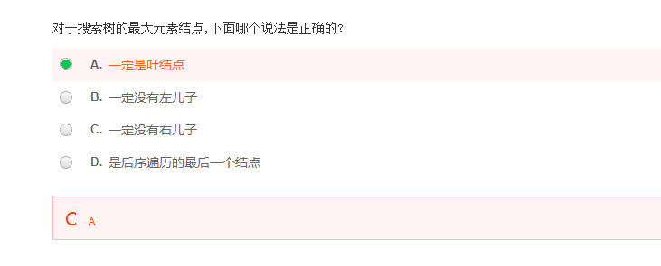

# 数据结构

[TOC]


## 第一章 概论 (算法和复杂度)



printN1循环 printN2递归(在100000内存溢出,程序异常退出)

※核心:

​	1.学会用"在线处理"找最大子列和(找最大值和最小值)

​	2.二分查找 (⚠从小到大Right=mid-1;Left=mid+1) [1.1.c]

时间复杂度和空间复杂度的计算 [1.8.c]

## 第二章 链表,基础语法,递归

## 第三章 线性,多重链,广义表 堆栈 队列


### 堆栈(线性,链式):

定义

插入:入栈

删除:出栈

栈空 top=-1

一个元素 top=0

栈满 top=Maxsize-1

**利用数组实现两个堆栈**

##### **链式:栈顶指针Top在链表头上.**

### C函数

[enum利用-菜鸟教程]: https://www.runoob.com/cprogramming/c-enum.html



[C 标准库 - <ctype.h>]: https://www.runoob.com/cprogramming/c-standard-library-ctype-h.html

##### isdigit():判断是否为数字

##### isalpha():判断是否为字母

toupper():**将小写转换为大写字母**

#####  **atof()  <stdio.h>:**

C 库函数 **double atof(const char \*str)** 把参数 **str** 所指向的字符串转换为一个浮点数（类型为 double 型）。


### 队列:先进先出

队列为空:Front=Rear

队列中只有一个元素,Rear-Front=1

队列满:Rear+1=Front(对于少用一个元素空间: (Rear+1)%数组长度=Front)

## 第四章 树



### 二叉树的表示



一棵度为 m的树有n个节点。若每个节点直接用m个链指向相应的儿子，则表示这个树所需要的总空间是n*(m+1) (假定每个链以及表示节点的数据域都是一个单位空间).。当采用儿子/兄弟（First Child/Next Sibling）表示法时，所需的总空间是：3m

如果一个完全二叉树最底下一层为第六层（根为第一层）且该层共有8个叶结点，那么该完全二叉树共有多少个结点？

```
前五层 2+4+8+16=31

第六层 8  

合计39
```



若一搜索树（查找树）是一个有n个结点的完全二叉树，则该树的最大值一定在叶结点上 错

若一搜索树（查找树）是一个有n个结点的完全二叉树，则该树的最小值一定在叶结点上 对

## 第七章 排序

对于7个数进行冒泡排序，最坏情况下需要进行的比较次数为21

7*6/2=21  (n\*(n-1))/2

### 	堆排序

### 	冒泡排序

```C
#include <stdio.h>
void sort(int a[],int n){
	int i,j;
	int flag=0;//判断是否进行了交换
	for (i=n-1;i>=0;i--){
		flag=0;
		for(j=0;j<i;j++){
			if(a[j]>a[j+1]){
				int temp=a[j];
				a[j]=a[j+1];
				a[j+1]=temp;
				flag=1;
			}
		}
		if(flag==0){
			break;
		}
	}
}
```


### 	希尔排序

### 	快速排序

### 	归并排序(外排序)

### 	桶排序

### 	基数排序


